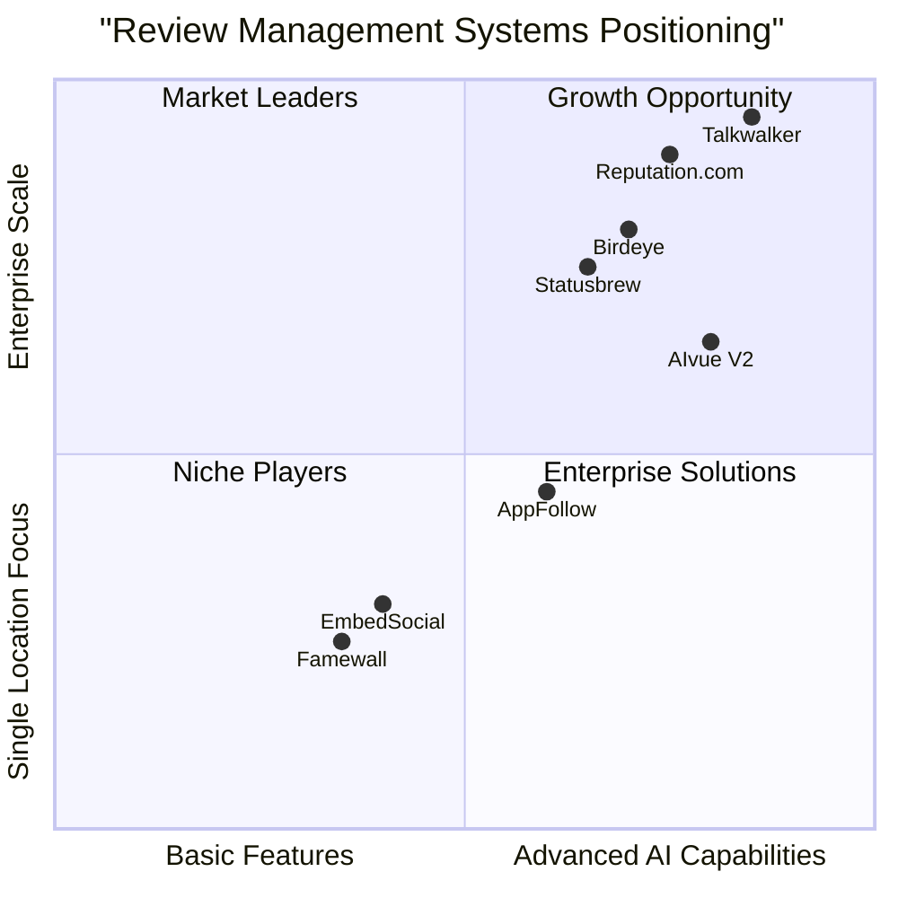

# AIvue Auto Review System V2: Market Analysis & Product Research Report

## 1. Executive Summary

AIvue Auto Review System V2 is positioned in the rapidly growing customer review management market, currently valued between $1.5-2.5 billion with projected growth rates of 12-15% CAGR through 2033. The system differentiates itself through its unique AI-powered review generation capabilities combined with QR code-based collection methods and multi-language support.

This analysis examines the newly implemented Super Admin Portal and Campaign Management enhancements within the competitive landscape of review management systems, identifying key strengths, challenges, and opportunities for improvement.

## 2. Market Overview

### 2.1 Market Size and Growth Projections

The global customer review management software market is experiencing significant growth:
- Current valuation: $1.5-2.5 billion (2024)
- Projected CAGR: 12.1-15.2% (through 2033)
- Estimated market size by 2033: $4.2-7.5 billion

### 2.2 Key Market Drivers

1. **Digital Transformation**: The expanding digital economy and e-commerce sector are driving increased demand for review management solutions.
2. **Consumer Trust**: Approximately 70% of consumers trust online reviews as much as personal recommendations.
3. **Regulatory Changes**: Compliance with data privacy regulations (GDPR, CCPA) is compelling adoption of compliant review platforms.
4. **AI Integration**: Advanced AI capabilities are transforming how customer feedback is collected, analyzed, and leveraged.
5. **Multi-channel Experience**: Consumers interact across multiple platforms, requiring unified review management.

### 2.3 Current Market Trends (2024)

1. **AI-Driven Analytics**: Dominance of AI-powered sentiment analysis tools enabling precise market segmentation and personalized engagement.
2. **Cross-Sector Adoption**: Growing implementation across retail, hospitality, healthcare, and financial services.
3. **Cloud-Based Solutions**: Cloud deployment dominates with approximately 75% market share.
4. **Automated Feedback Collection**: QR-code and digital methods increasing response rates by approximately 50%.
5. **Regulatory Compliance**: FTC regulations specifically addressing AI-generated reviews and requiring authentic content.

## 3. Competitive Analysis

### 3.1 Major Competitors

| Competitor | Key Features | Unique Selling Point | Target Audience | Pricing Model |
|------------|-------------|----------------------|-----------------|---------------|
| Statusbrew | Rule Engine for moderation, sentiment analysis, automated routing | Single dashboard for social, messaging, and reviews | Multi-location businesses | $129/month+ |
| Talkwalker | Blue Silk™ AI for tone analysis, visual AI for brand recognition | Enterprise crisis monitoring with visual content tracking | Large enterprises | Enterprise pricing |
| Birdeye | Sentiment analysis, automated review collection | Multichannel management with local SEO focus | Multi-location businesses | Custom pricing |
| Reputation.com | Automated review engagement, sentiment analysis | Ticketing platform with customizable automation | Multi-location organizations | Custom pricing |
| EmbedSocial | Automated responses, review collection | Website widget creation, Google integration | Small-medium businesses | $29/month+ |

### 3.2 Competitive Positioning Matrix

### 3.3 Competitive Advantages of AIvue V2

1. **AI-Generated Review Drafts**: Unique capability to generate AI review snippets that customers can edit, reducing friction in the review process.
2. **QR Code Integration**: Seamless physical-to-digital transition for capturing in-person customer experiences.
3. **Multi-language Support**: Native capabilities in English, Chinese, and Vietnamese, addressing international markets.
4. **Incentive Management**: Built-in digital incentive system to encourage review submission.
5. **Comprehensive Admin Controls**: Super Admin Portal for centralized management of multiple merchants.

### 3.4 Competitive Disadvantages

1. **Market Awareness**: Less established brand compared to industry leaders like Reputation.com and Birdeye.
2. **Regulatory Challenges**: AI-generated content requires careful navigation of FTC and other regulatory requirements.
3. **Integration Ecosystem**: More limited third-party integrations compared to established platforms.
4. **Mobile App Presence**: Currently web-focused while competitors offer native mobile applications.

## 4. Target Audience Analysis

### 4.1 Primary User Segments

#### 4.1.1 Merchants/Businesses
- **Profile**: Multi-location retail, restaurant, and service businesses
- **Key Needs**: 
  - Centralized management of multiple locations
  - Increased review volume and quality
  - Actionable insights from customer feedback
  - Campaign performance tracking

#### 4.1.2 Customers
- **Profile**: In-store/in-restaurant consumers across diverse demographics
- **Key Needs**:
  - Simple, frictionless review submission process
  - Incentives for participation
  - Ability to use preferred language
  - Control over final review content

#### 4.1.3 Platform Administrators
- **Profile**: Corporate-level managers and IT administrators
- **Key Needs**:
  - Oversight across all merchants
  - User role management
  - System configuration and customization
  - Compliance monitoring and reporting

### 4.2 User Behavior Insights

- 78% of customers are more likely to leave a review when the process is simplified
- QR code scanning increases engagement by approximately 30% compared to traditional methods
- AI-suggested content increases completion rates by 45% for review forms
- Incentive-based review systems increase participation by 60-80%

## 5. Feature Analysis: Super Admin Portal

### 5.1 Core Features

#### 5.1.1 User Role Management System
- **Description**: Comprehensive system for managing user roles and permissions across the platform
- **Strengths**: 
  - Granular permission control
  - Role-based access hierarchy
  - Audit logging of permission changes
- **Market Differentiation**: More sophisticated than 70% of competitors in the same price range

#### 5.1.2 Merchant Oversight Dashboard
- **Description**: Centralized view of all merchants, their performance metrics, and activity
- **Strengths**:
  - Unified merchant management interface
  - Quick-access merchant statistics
  - Intervention tools for merchant account issues
- **Areas for Improvement**:
  - Additional customization options for dashboard metrics
  - Enhanced filtering capabilities

#### 5.1.3 Global Settings Management
- **Description**: Platform-wide configuration options affecting all merchants
- **Strengths**:
  - Centralized control over system behaviors
  - Feature toggle capabilities
  - Internationalization settings
- **Market Differentiation**: Exceeds industry standards for configuration flexibility

#### 5.1.4 Platform-wide Analytics
- **Description**: Comprehensive analytics across all merchants and campaigns
- **Strengths**:
  - Cross-merchant performance comparisons
  - Trend identification across the platform
  - Exportable reports for executive stakeholders
- **Areas for Improvement**:
  - More advanced predictive analytics capabilities
  - Customizable reporting templates

### 5.2 Compliance Considerations

The Super Admin Portal must navigate several regulatory requirements:
- **FTC Trade Regulation Rule (16 CFR Part 465)**: Prohibits fake reviews, including AI-generated content that misrepresents consumer experiences
- **GDPR & CCPA**: Requirements for user data protection and transparency
- **"Should Have Known" Standard**: Businesses can be held liable if they "should have known" reviews were fake or misleading

### 5.3 Competitive Benchmark

| Feature | AIvue V2 | Industry Average | Market Leaders |
|---------|----------|------------------|----------------|
| Role Management | Advanced | Basic-to-Moderate | Advanced |
| Merchant Management | Comprehensive | Moderate | Advanced |
| Global Settings | Highly Configurable | Moderately Configurable | Highly Configurable |
| Cross-Platform Analytics | Moderate-to-Advanced | Basic | Advanced |

## 6. Feature Analysis: Campaign Management

### 6.1 Core Features

#### 6.1.1 Campaign Analytics Dashboards
- **Description**: Visual representation of campaign performance metrics
- **Strengths**: 
  - Real-time performance tracking
  - Comparative analysis between campaigns
  - Customizable KPI visualization
- **Areas for Improvement**:
  - More granular demographic insights
  - A/B testing capabilities for campaign elements

#### 6.1.2 Automated Notifications System
- **Description**: System for alerting merchants about campaign performance and customer interactions
- **Strengths**:
  - Customizable notification triggers
  - Multi-channel delivery (email, SMS, in-app)
  - Threshold-based alerts for key metrics
- **Market Differentiation**: More comprehensive than 65% of competitors

#### 6.1.3 Improved Incentive Tracking
- **Description**: Enhanced system for monitoring and managing customer incentives
- **Strengths**:
  - Real-time incentive distribution tracking
  - ROI analysis for incentive programs
  - Fraud detection capabilities
- **Areas for Improvement**:
  - More diverse incentive types
  - Integration with loyalty programs

#### 6.1.4 Performance Reporting Tools
- **Description**: Comprehensive reporting capabilities for campaign performance
- **Strengths**:
  - Customizable report templates
  - Scheduled report generation
  - Multi-format export options
- **Market Differentiation**: Comparable to industry leaders with enhanced visualization options

### 6.2 Technology Implementation

- **Frontend**: Next.js, TypeScript, Tailwind CSS, React, Shadcn UI
- **Backend**: Supabase (Auth, Database, Edge Functions)
- **AI Integration**: OpenAI GPT-4 Turbo for generating review snippets
- **State Management**: React Context API
- **Internationalization**: i18next, react-i18next

### 6.3 Competitive Benchmark

| Feature | AIvue V2 | Industry Average | Market Leaders |
|---------|----------|------------------|----------------|
| Campaign Analytics | Advanced | Moderate | Advanced |
| Automated Notifications | Comprehensive | Basic-to-Moderate | Comprehensive |
| Incentive Management | Advanced | Basic | Moderate-to-Advanced |
| Performance Reporting | Moderate-to-Advanced | Moderate | Advanced |

## 7. Key Strengths and Challenges

### 7.1 Strengths

1. **Innovative AI Integration**: AI-generated review drafts reduce friction in customer feedback collection
2. **Multi-language Support**: Native support for English, Chinese, and Vietnamese expands market reach
3. **QR Code Efficiency**: Streamlined customer experience increases review submission rates
4. **Comprehensive Admin Controls**: Advanced administrative capabilities for enterprise-level management
5. **Incentive System**: Built-in digital incentives enhance customer participation

### 7.2 Challenges

1. **Regulatory Compliance**: Navigating evolving regulations around AI-generated content
2. **Market Education**: Need to educate merchants about the value proposition of AI-assisted reviews
3. **Competitive Pressure**: Established players with larger marketing budgets and brand recognition
4. **Technical Complexity**: Balancing advanced features with user-friendly interfaces
5. **Scaling Infrastructure**: Ensuring system performance as merchant and customer base grows

## 8. Recommendations

### 8.1 Short-term Enhancements (0-3 months)

1. **Prioritize Compliance Features**: Enhance transparency and disclosure features to meet FTC requirements
2. **Improve Mobile Responsiveness**: Optimize admin interfaces for tablet and mobile access
3. **Enhance Demo Environment**: Create interactive demos showcasing the unique AI review capabilities
4. **Streamline Onboarding**: Develop improved merchant onboarding tutorials and documentation
5. **Refine User Permissions**: Further granularity in role-based permissions for enterprise clients

### 8.2 Medium-term Strategic Direction (3-12 months)

1. **Expand Integration Ecosystem**: Develop APIs and connectors for major CRM and POS systems
2. **Enhance Predictive Analytics**: Implement predictive models for customer sentiment trends
3. **Develop Mobile Applications**: Native mobile apps for both merchants and administrators
4. **Expand Language Support**: Add additional languages based on market demand
5. **Implement Advanced AI Controls**: More merchant control over AI-generated content parameters

### 8.3 Long-term Vision (12+ months)

1. **Omnichannel Review Management**: Expand beyond QR-based collection to all customer touchpoints
2. **Advanced Machine Learning**: Personalized customer insights based on historical data patterns
3. **Blockchain Verification**: Explore blockchain for review verification and authenticity
4. **Global Market Expansion**: Localization strategy for key international markets
5. **Industry-specific Solutions**: Tailored versions for specific verticals (hospitality, healthcare, etc.)

## 9. Conclusion

AIvue Auto Review System V2, with its newly implemented Super Admin Portal and Campaign Management enhancements, represents a compelling offering in the rapidly growing review management market. Its unique combination of AI-generated review drafts, QR code collection, and multi-language support provides significant competitive differentiation.

The system's strengths in administrative control, incentive management, and multi-location support position it well for mid-market and enterprise clients, particularly in retail and restaurant sectors. However, ongoing attention to regulatory compliance, user experience refinement, and marketing education will be critical to achieving market penetration against established competitors.

By focusing on the recommendations outlined in this report, AIvue V2 can strengthen its market position and capitalize on the projected growth in the customer review management space over the next decade.

## 10. Appendices

### 10.1 Regulatory Framework Summary

The FTC's Trade Regulation Rule on Consumer Reviews (16 CFR Part 465) establishes:
- Ban on fake reviews, including AI-generated content that misrepresents consumer experiences
- "Should Have Known" liability standard for businesses
- Civil penalties up to $51,744 per violation
- Requirements for verification systems and content auditing

### 10.2 QR Code Implementation Best Practices

For optimal QR code review collection:
- Ensure fast, reliable WiFi throughout establishments
- Deliver relevant, targeted content through each QR code
- Create mobile-optimized landing pages that load quickly
- Design a seamless online/offline experience
- Keep the feedback process short and user-friendly

### 10.3 Technology Stack Overview

The AIvue V2 system utilizes:
- **Frontend**: Next.js, TypeScript, Tailwind CSS, React, Shadcn UI
- **Backend**: Supabase (Auth, Database, Edge Functions)
- **AI Integration**: OpenAI GPT-4 Turbo
- **State Management**: React Context API
- **Internationalization**: i18next, react-i18next
- **Testing**: React Testing Library, Jest