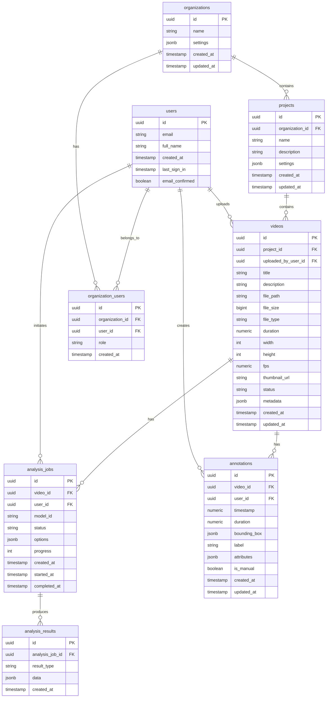
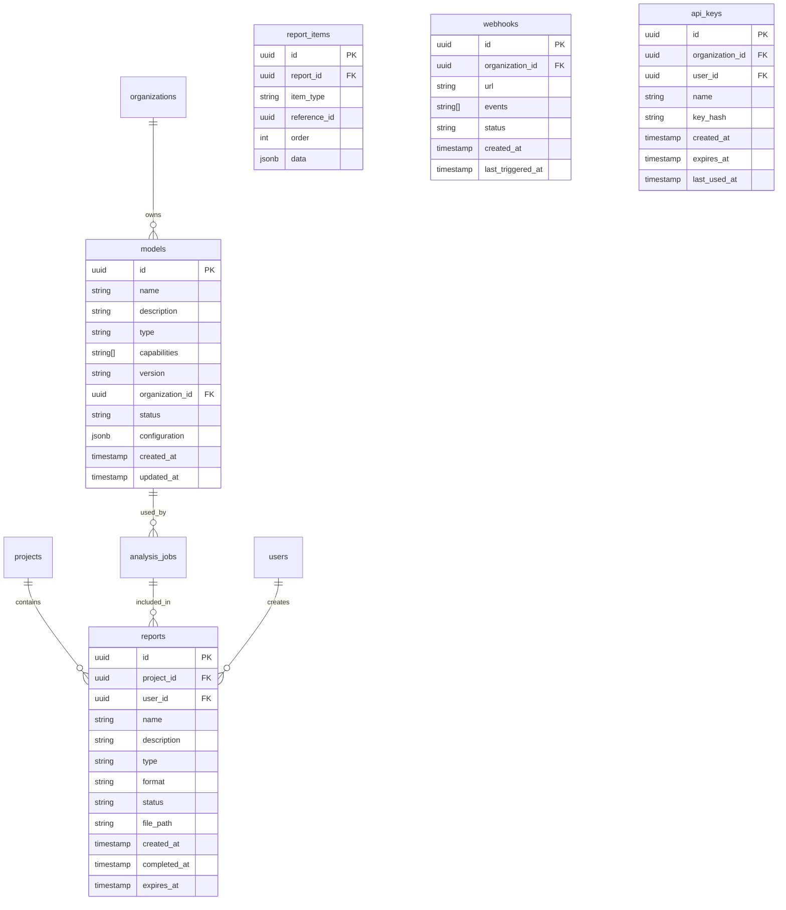

# Vuebie Data Model

This document outlines the database schema and data structures used in the Vuebie platform.

## Database Schema

Vuebie uses PostgreSQL (via Supabase) with the following table structure:

### Core Tables



### Supporting Tables



## Table Descriptions

### organizations

Represents companies or teams using the Vuebie platform.

| Column | Type | Description |
|--------|------|-------------|
| id | uuid | Primary key |
| name | text | Organization name |
| settings | jsonb | Organization-wide settings |
| created_at | timestamp | Creation timestamp |
| updated_at | timestamp | Last update timestamp |

### organization_users

Junction table linking users to organizations with role information.

| Column | Type | Description |
|--------|------|-------------|
| id | uuid | Primary key |
| organization_id | uuid | Foreign key to organizations |
| user_id | uuid | Foreign key to users |
| role | text | User role (admin, manager, editor, viewer) |
| created_at | timestamp | Creation timestamp |

### users

User accounts for the Vuebie platform.

| Column | Type | Description |
|--------|------|-------------|
| id | uuid | Primary key |
| email | text | User email address |
| full_name | text | User's full name |
| created_at | timestamp | Account creation timestamp |
| last_sign_in | timestamp | Most recent sign-in timestamp |
| email_confirmed | boolean | Whether email is verified |

### projects

Collections of related videos within an organization.

| Column | Type | Description |
|--------|------|-------------|
| id | uuid | Primary key |
| organization_id | uuid | Foreign key to organizations |
| name | text | Project name |
| description | text | Project description |
| settings | jsonb | Project-specific settings |
| created_at | timestamp | Creation timestamp |
| updated_at | timestamp | Last update timestamp |

### videos

Video files uploaded to the Vuebie platform.

| Column | Type | Description |
|--------|------|-------------|
| id | uuid | Primary key |
| project_id | uuid | Foreign key to projects |
| uploaded_by_user_id | uuid | Foreign key to users |
| title | text | Video title |
| description | text | Video description |
| file_path | text | Storage path to video file |
| file_size | bigint | File size in bytes |
| file_type | text | File format (mp4, mov, etc.) |
| duration | numeric | Video duration in seconds |
| width | integer | Video width in pixels |
| height | integer | Video height in pixels |
| fps | numeric | Frames per second |
| thumbnail_url | text | URL to video thumbnail |
| status | text | Processing status (pending, processing, complete, error) |
| metadata | jsonb | Additional video metadata |
| created_at | timestamp | Upload timestamp |
| updated_at | timestamp | Last update timestamp |

### analysis_jobs

Video analysis operations run by the Vuebie AI system.

| Column | Type | Description |
|--------|------|-------------|
| id | uuid | Primary key |
| video_id | uuid | Foreign key to videos |
| user_id | uuid | Foreign key to users who initiated the job |
| model_id | text | Reference to the model used |
| status | text | Job status (queued, processing, complete, error) |
| options | jsonb | Analysis configuration options |
| progress | integer | Progress percentage (0-100) |
| created_at | timestamp | Job creation timestamp |
| started_at | timestamp | When processing began |
| completed_at | timestamp | When processing finished |

### analysis_results

Results produced by analysis jobs, separated by result type.

| Column | Type | Description |
|--------|------|-------------|
| id | uuid | Primary key |
| analysis_job_id | uuid | Foreign key to analysis_jobs |
| result_type | text | Type of result (objects, faces, transcript, etc.) |
| data | jsonb | The actual analysis data |
| created_at | timestamp | Creation timestamp |

### annotations

Manual or automatic annotations of video content.

| Column | Type | Description |
|--------|------|-------------|
| id | uuid | Primary key |
| video_id | uuid | Foreign key to videos |
| user_id | uuid | Foreign key to users (creator of manual annotations) |
| timestamp | numeric | Time position in the video (seconds) |
| duration | numeric | Duration of the annotation (seconds) |
| bounding_box | jsonb | Spatial coordinates {x, y, width, height} |
| label | text | Annotation label |
| attributes | jsonb | Additional annotation attributes |
| is_manual | boolean | Whether created manually or by AI |
| created_at | timestamp | Creation timestamp |
| updated_at | timestamp | Last update timestamp |

### models

AI models available for analysis.

| Column | Type | Description |
|--------|------|-------------|
| id | uuid | Primary key |
| name | text | Model name |
| description | text | Model description |
| type | text | Model type (standard, custom) |
| capabilities | text[] | Analysis capabilities |
| version | text | Model version |
| organization_id | uuid | Foreign key to organizations (null for standard models) |
| status | text | Model status (active, deprecated, training) |
| configuration | jsonb | Model configuration |
| created_at | timestamp | Creation timestamp |
| updated_at | timestamp | Last update timestamp |

### reports

Generated analysis reports.

| Column | Type | Description |
|--------|------|-------------|
| id | uuid | Primary key |
| project_id | uuid | Foreign key to projects |
| user_id | uuid | Foreign key to users |
| name | text | Report name |
| description | text | Report description |
| type | text | Report type (summary, detailed, custom) |
| format | text | Output format (pdf, csv, json, html) |
| status | text | Processing status (pending, processing, complete, error) |
| file_path | text | Storage path to report file |
| created_at | timestamp | Creation timestamp |
| completed_at | timestamp | Completion timestamp |
| expires_at | timestamp | When the download link expires |

### report_items

Individual elements within a report.

| Column | Type | Description |
|--------|------|-------------|
| id | uuid | Primary key |
| report_id | uuid | Foreign key to reports |
| item_type | text | Type of item (chart, table, text, image) |
| reference_id | uuid | Reference to source data (video, analysis) |
| order | integer | Display order in the report |
| data | jsonb | Item content and configuration |

### webhooks

Configured webhook endpoints for event notifications.

| Column | Type | Description |
|--------|------|-------------|
| id | uuid | Primary key |
| organization_id | uuid | Foreign key to organizations |
| url | text | Webhook endpoint URL |
| events | text[] | Event types to trigger this webhook |
| status | text | Webhook status (active, disabled) |
| created_at | timestamp | Creation timestamp |
| last_triggered_at | timestamp | Last successful trigger |

### api_keys

API authentication keys.

| Column | Type | Description |
|--------|------|-------------|
| id | uuid | Primary key |
| organization_id | uuid | Foreign key to organizations |
| user_id | uuid | Foreign key to users |
| name | text | Key name/description |
| key_hash | text | Hashed API key |
| created_at | timestamp | Creation timestamp |
| expires_at | timestamp | Expiration timestamp |
| last_used_at | timestamp | Last usage timestamp |

## Data Examples

### Example Video Entry

```json
{
  "id": "vid_123456789",
  "project_id": "prj_987654321",
  "uploaded_by_user_id": "usr_abcdef123",
  "title": "Product Demo - Summer 2025",
  "description": "Official product demonstration for the new lineup",
  "file_path": "organizations/org_123/projects/prj_987654321/videos/vid_123456789.mp4",
  "file_size": 258769420,
  "file_type": "mp4",
  "duration": 1245.75,
  "width": 1920,
  "height": 1080,
  "fps": 30.00,
  "thumbnail_url": "https://storage.vuebie.com/thumbnails/vid_123456789.jpg",
  "status": "complete",
  "metadata": {
    "recorded_date": "2025-06-15",
    "location": "Studio B",
    "camera": "Sony FX6",
    "tags": ["product", "official", "demo"]
  },
  "created_at": "2025-07-12T15:30:00Z",
  "updated_at": "2025-07-12T15:45:00Z"
}
```

### Example Analysis Results

```json
{
  "id": "res_123456789",
  "analysis_job_id": "ana_987654321",
  "result_type": "objects",
  "data": {
    "objects": [
      {
        "timestamp": 12.5,
        "duration": 8.2,
        "label": "laptop",
        "confidence": 0.97,
        "bounding_box": {
          "x": 0.2,
          "y": 0.4,
          "width": 0.3,
          "height": 0.15
        },
        "tracking_id": "obj_1"
      },
      {
        "timestamp": 15.8,
        "duration": 12.4,
        "label": "phone",
        "confidence": 0.95,
        "bounding_box": {
          "x": 0.6,
          "y": 0.5,
          "width": 0.1,
          "height": 0.08
        },
        "tracking_id": "obj_2"
      }
    ],
    "summary": {
      "object_counts": {
        "laptop": 1,
        "phone": 1,
        "person": 2
      },
      "total_objects": 4
    }
  },
  "created_at": "2025-07-15T10:24:36Z"
}
```

## Database Policies

Vuebie implements row-level security in Supabase with the following key policies:

### Organization Access

- Users can only access organizations they belong to
- Organization admins can manage all organization data
- Organization members can access data based on their role

### Project Access

- Users can only access projects within their organizations
- Project-specific roles can override organization roles

### Video Access

- Users can only access videos within projects they have access to
- Viewers cannot modify or delete videos
- Editors can upload and modify videos but not delete them
- Managers and admins can perform all operations

## Data Relationships

### Organization Hierarchy

```
Organization
└── Projects
    └── Videos
        ├── Analysis Jobs
        │   └── Analysis Results
        └── Annotations
```

### User Relationships

```
User
├── Organization Memberships
├── Uploaded Videos
├── Initiated Analysis Jobs
├── Created Annotations
└── Generated Reports
```

## Data Flow

1. **Video Upload**: User uploads a video, creating a record in the `videos` table
2. **Processing**: Backend services update video metadata and status
3. **Analysis**: User initiates analysis, creating a record in `analysis_jobs`
4. **Results Processing**: Analysis results are stored in `analysis_results`
5. **Annotation**: Users can create manual annotations in `annotations`
6. **Reporting**: Users can generate reports that reference videos and analysis results

## Data Retention

- Video files and analysis results follow the organization's data retention policy
- Default retention periods:
  - Free tier: 30 days
  - Professional tier: 1 year
  - Enterprise tier: Configurable (up to forever)
- Deleted videos and projects remain in "soft deleted" status for 30 days before permanent removal

## Compliance

The Vuebie data model is designed for compliance with:

- GDPR
- CCPA
- HIPAA (with Enterprise tier security features)
- SOC 2 (with Enterprise tier security features)

## Schema Versioning

The Vuebie database schema uses versioned migrations to track changes over time. All schema changes must follow these guidelines:

- Use migrations for all schema changes
- Ensure backward compatibility or provide upgrade paths
- Document breaking changes in release notes
- Include rollback procedures for each migration