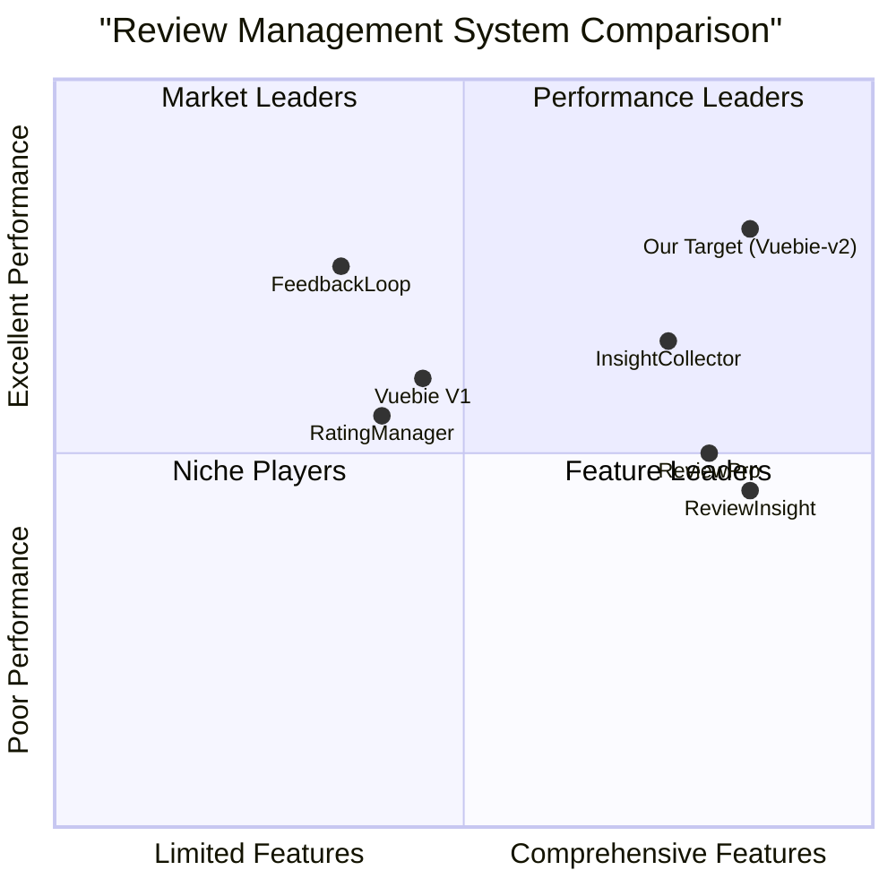

# Vuebie Auto Review System V2 - Implementation Requirements

## Project Overview

**Project Name:** Vuebie-v2  
**Programming Language:** TypeScript, Next.js, Tailwind CSS, Shadcn UI  
**Backend Service:** Supabase  

## Original Requirements

Review and analyze the Vuebie-v2 project documentation to understand:
1. The implementation plan for the project
2. Details on the critical role permission inheritance bug
3. Other issues that need to be addressed within the 3-week timeline

## Product Definition

### Product Goals

1. **Fix Critical Security Vulnerabilities**: Address the role permission inheritance bug and other security issues to ensure proper system access control and data protection.
2. **Implement Core Features**: Deliver essential functionality of the Super Admin Portal and Campaign Management enhancements within the compressed timeline.
3. **Ensure System Performance**: Optimize the system to handle large datasets and ensure responsive performance for all users.

### User Stories

1. **As a system administrator**, I want proper role permission inheritance to work correctly so that I can assign appropriate access levels without worrying about security vulnerabilities.
2. **As a super admin**, I want to manage merchant accounts and user roles effectively so that I can properly administer the platform.
3. **As a merchant**, I want to access only data relevant to my business so that my sensitive information remains secure from other merchants.
4. **As a campaign manager**, I want enhanced reporting tools so that I can make data-driven decisions about my campaigns.
5. **As an international user**, I want full multi-language support so that I can use the system in my preferred language.

### Competitive Analysis

| Product | Pros | Cons |
|---------|------|------|
| Vuebie V1 | - Established user base - Proven core functionality - Familiar interface | - Lacks advanced permission system - Limited reporting capabilities - No A/B testing features |
| ReviewPro | - Comprehensive reporting - Multi-tenant architecture - Good security model | - Complex interface - Higher cost - Slower performance with large datasets |
| FeedbackLoop | - Simple permission model - Fast performance - Clean UI | - Limited customization - Fewer advanced features - No super admin capabilities |
| InsightCollector | - Strong role-based access - Advanced analytics - Good performance | - Steep learning curve - Expensive enterprise model - Limited language support |
| RatingManager | - Good multi-language support - Simple campaign setup - Intuitive UI | - Basic reporting only - Limited role management - No A/B testing |
| ReviewInsight | - Strong security model - Built-in A/B testing - Advanced reporting | - Slow with large datasets - Complex permission setup - Limited customization |
| Our Target (Vuebie-v2) | - Enhanced permission system - Advanced campaign reporting - Super admin capabilities | - Under development - Critical bugs to fix - Compressed timeline |

### Competitive Quadrant Chart

## Technical Analysis

### Current Implementation Plan

The original implementation plan outlines a 7-week development timeline divided into three phases:

**Phase 1: Super Admin Portal Development (4 weeks)**
- Merchant Account Oversight (2 weeks)
- User Role Management (1 week)
- Global Settings Configuration (1 week)

**Phase 2: Campaign Management Enhancements (2 weeks)**
- Enhanced Campaign Reporting (1 week)
- A/B Testing and Comparative Analysis (1 week)

**Phase 3: Testing and Integration (1 week)**
- Unit and component testing
- Integration and end-to-end testing
- Bug fixes and documentation

The plan includes resource requirements for a team of developers, data specialists, and QA engineers.

### Role Permission Inheritance Bug Analysis

#### Bug Description

The critical role permission inheritance bug affects the role-based access control (RBAC) system of Vuebie-v2. When permissions are assigned to roles and roles are assigned to users, the system fails to properly propagate and enforce those permissions. This results in users either having insufficient permissions or excessive permissions that create security vulnerabilities.

#### Technical Details

Based on the database schema and system architecture, the bug likely exists in how the following tables interact:

- `roles` - Contains role definitions
- `permissions` - Defines individual permissions 
- `role_permissions` - Maps roles to permissions
- `user_roles` - Maps users to roles

The root causes appear to be:

1. **Incomplete Permission Queries**: Inadequate joining of tables when checking permissions
2. **Incorrect Permission Inheritance Logic**: Failure to handle role hierarchies properly
3. **Cache Invalidation Issues**: Permission changes not reflected immediately due to caching problems
4. **Transaction Isolation**: Role and permission updates not maintaining data integrity

#### Impact

This bug creates serious security vulnerabilities where users may access features they shouldn't or be blocked from using features they should have access to. It affects both the Super Admin Portal and Merchant Dashboard.

### Other Critical Issues

1. **Cross-Tenant Data Access Vulnerability**
   - **Description**: Security issue where users might access data from other merchants
   - **Impact**: High - Potential data breach and violation of customer trust
   - **Technical details**: Improper row-level security policies in Supabase

2. **Performance Issues with Large Datasets**
   - **Description**: Reports and analytics experiencing slowdowns with large datasets
   - **Impact**: Medium - Degraded user experience and reduced productivity
   - **Technical details**: Unoptimized queries and lack of pagination/caching

3. **UI/UX Issues in Permission Management**
   - **Description**: Complex permission UI causing usability problems
   - **Impact**: Medium - Confusing experience for administrators
   - **Technical details**: Unintuitive interface design for complex permission structures

4. **Multi-language Support Gaps**
   - **Description**: Inconsistent language support across interface elements
   - **Impact**: Medium - Reduced usability for international users
   - **Technical details**: Missing translations and inconsistent i18n implementation

5. **Integration Issues Between Modules**
   - **Description**: Cross-module functionality not working correctly
   - **Impact**: Medium - Feature inconsistency and potential data integrity issues
   - **Technical details**: Inconsistent API contracts and insufficient integration testing

## Requirements Analysis

Given the compressed 3-week timeline (versus the original 7-week plan), we need to prioritize the critical security issues while delivering essential functionality.

### Requirements Pool

#### P0 (Must-Have)
1. Fix the role permission inheritance bug
2. Address cross-tenant data access vulnerability
3. Implement core Super Admin Portal functionality:
   - Basic merchant account management
   - Simplified role management system
4. Add audit logging for security-related actions

#### P1 (Should-Have)
1. Optimize performance for large datasets
2. Implement essential Campaign Management features:
   - Basic campaign reporting
   - Simple A/B testing capability
3. Improve permission management UI/UX
4. Fix integration issues between modules

#### P2 (Nice-to-Have)
1. Complete multi-language support
2. Advanced campaign reporting features
3. Global settings configuration
4. Comprehensive A/B testing and analysis tools

## Implementation Recommendations

### 3-Week Implementation Timeline

#### Week 1: Critical Bug Fixes and Security Issues
1. **Days 1-2: Analysis and Fix Design**
   - Detailed code review of permission-related components
   - Set up test cases to reproduce the bugs
   - Design robust fixes for identified issues

2. **Days 3-5: Implementation and Initial Testing**
   - Implement permission inheritance fix
   - Address cross-tenant data access vulnerability
   - Create unit and integration tests for security fixes

#### Week 2: Core Functionality Implementation
1. **Days 1-3: Super Admin Portal Essentials**
   - Implement merchant account management CRUD operations
   - Develop simplified role management system
   - Create basic user-role assignment workflow

2. **Days 4-5: Performance and Integration**
   - Optimize database queries for large datasets
   - Implement pagination and lazy loading
   - Fix integration issues between modules

#### Week 3: Testing, UI Improvements, and Campaign Features
1. **Days 1-2: Campaign Management Essentials**
   - Implement core campaign reporting features
   - Add minimal viable A/B testing functionality

2. **Days 3-5: Final Testing and Documentation**
   - Comprehensive security testing
   - UI/UX improvements for permission management
   - Complete documentation and knowledge transfer

### Technical Solution for Role Permission Inheritance Bug

The solution requires fixing multiple components:

1. **Correct Database Query Implementation**
   - Properly join all relevant tables when checking permissions
   - Ensure correct traversal of role hierarchies

2. **Implement Proper Permission Caching**
   - Add caching with appropriate TTL
   - Implement cache invalidation when permissions change

3. **Add Database Triggers**
   - Create triggers to ensure permission changes propagate correctly
   - Log all permission changes for audit purposes

4. **Comprehensive Logging**
   - Log all permission checks and their results
   - Create alerts for suspicious permission activities

### Solution for Cross-Tenant Data Access

1. **Enhanced Row-Level Security**
   - Implement strict RLS policies in Supabase
   - Add tenant ID validation in all API endpoints

2. **Data Access Auditing**
   - Log all cross-tenant access attempts
   - Create alerts for potential security violations

## UI Design Draft

### Permission Management Interface

The improved permission management interface should:

1. Provide a clear hierarchy visualization of roles and permissions
2. Offer drag-and-drop functionality for permission assignment
3. Include search and filter capabilities for large permission sets
4. Provide role templates for common configurations
5. Display inheritance relationships between roles
6. Show affected users when permission changes are made

### Super Admin Dashboard

The essential Super Admin Dashboard should include:

1. Merchant overview with key metrics
2. User and role management section
3. Security and audit log viewer
4. System health monitoring
5. Quick actions for common administrative tasks

## Open Questions

1. **Role Hierarchy Depth**: What is the maximum depth of role inheritance that needs to be supported?
2. **Permission Granularity**: How fine-grained do permissions need to be for the minimum viable product?
3. **Performance Requirements**: What are the specific performance targets for permission checks?
4. **Audit Requirements**: Are there specific compliance requirements for permission audit logging?
5. **Migration Path**: How will existing roles and permissions be migrated to the new system?

## Risk Assessment

1. **Shortened Timeline Risk**
   - The original plan was for 7 weeks, now compressed to 3 weeks
   - **Mitigation**: Focus on critical security and functionality issues first, defer non-essential features

2. **Regression Risk**
   - Fixing permission system may introduce new bugs in other areas
   - **Mitigation**: Implement comprehensive regression testing and staged deployment

3. **Resource Constraints**
   - Original plan assumed more developers than may be available
   - **Mitigation**: Prioritize critical paths and consider pair programming for complex issues

4. **Technical Debt**
   - Compressed timeline may lead to shortcuts and technical debt
   - **Mitigation**: Clearly document any technical debt created and plan for future refactoring

## Conclusion

The 3-week implementation plan focuses on addressing the critical role permission inheritance bug and other security issues while delivering essential functionality. By prioritizing security fixes and core features, we can ensure that the Vuebie-v2 system is secure, functional, and ready for further enhancements in future iterations.

The implementation should be closely monitored with daily stand-ups to track progress and identify blockers early. Regular communication with stakeholders about the revised scope and timeline expectations will be essential for project success.