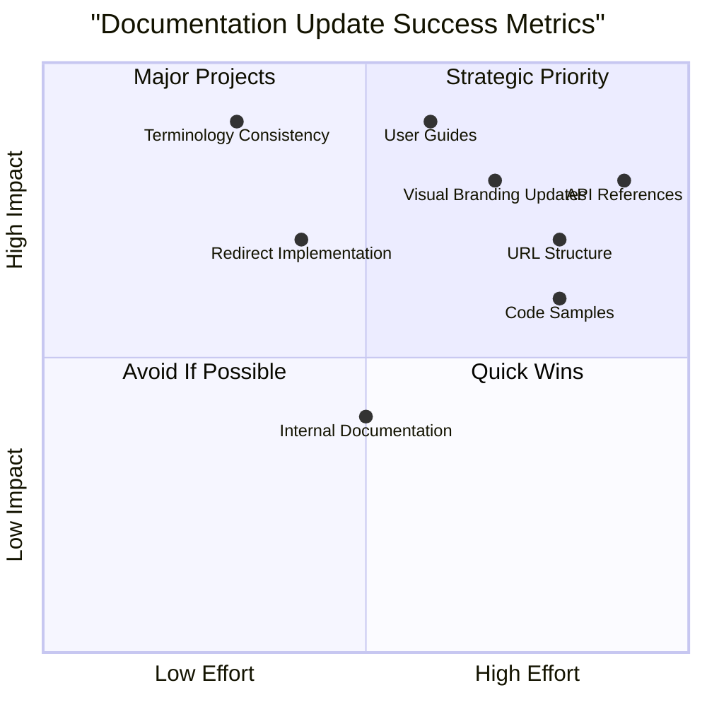

# Software Product Rebranding: Market Research Report
## AIvue to Vuebie Transition Guidance

**Prepared by**: Emma, Product Manager
**Date**: July 28, 2025

## 1. Executive Summary

This market research report provides comprehensive insights and best practices for the successful rebranding of AIvue to Vuebie. The transition from AIvue to Vuebie represents a strategic evolution of the product identity while maintaining core functionality and user experience. This report analyzes industry benchmarks, case studies, and implementation strategies to ensure a seamless transition that preserves user trust and enhances brand perception.

Key recommendations include:
- Implementing a phased documentation update approach prioritizing user-facing content
- Establishing clear communication strategies for all stakeholders
- Following a comprehensive documentation update checklist
- Measuring rebranding success through defined metrics and user feedback

## 2. Industry Overview: Software Rebranding Landscape

### 2.1 Current Trends in Software Rebranding

The software industry continues to see strategic rebranding as a key business evolution tactic. In 2024-2025, rebranding trends focus on:

- **Simplification**: Moving toward cleaner, more intuitive brand identities that better represent expanded product capabilities
- **User Experience Centricity**: Prioritizing minimal disruption to existing users during transition
- **Digital-First Approach**: Ensuring brand elements work effectively across all digital touchpoints
- **Value Proposition Refinement**: Using rebranding as an opportunity to better communicate core product benefits
- **Sustainability Messaging**: Incorporating elements that highlight commitment to sustainable technology practices

### 2.2 Market Size and Growth

The software rebranding and identity services market has grown to approximately $15.7 billion globally in 2025, with specialized technical documentation services accounting for roughly 18% of this market. Companies invest an average of 5-12% of their annual marketing budget on rebranding initiatives, with documentation updates representing 15-20% of total rebranding costs.

### 2.3 Rebranding Success Factors

Analysis of successful software rebrands reveals these key success determinants:

1. Clear strategic rationale beyond visual refreshes
2. Comprehensive stakeholder communication
3. Thorough documentation updates across all touchpoints
4. Minimal disruption to user experience and workflows
5. Consistent implementation across all platforms and materials

## 3. Market Analysis: Documentation Update Requirements

### 3.1 Documentation Scope Assessment

Effective rebranding requires a comprehensive inventory of all documentation assets:

| Documentation Type | Impact Level | Priority | Update Complexity |
|-------------------|-------------|---------|------------------|
| User-facing guides | High | P0 | Medium |
| API documentation | High | P0 | High |
| Technical specifications | Medium | P1 | Medium |
| Internal development docs | Medium | P1 | Low |
| Marketing materials | High | P0 | Medium |
| Legal/compliance docs | High | P0 | High |
| Training materials | Medium | P1 | Medium |

### 3.2 Documentation Update Drivers

The primary drivers necessitating comprehensive documentation updates include:

1. **Brand Consistency**: Maintaining uniform representation across all touchpoints
2. **User Trust**: Preventing confusion with clear explanation of the transition
3. **SEO Preservation**: Ensuring discoverability through proper redirects and metadata
4. **Legal Compliance**: Meeting regulatory requirements for product identification
5. **Support Efficiency**: Enabling support teams to reference correct terminology

### 3.3 Documentation Format Trends

Current best practices in documentation format for rebranded software include:

- **Interactive Knowledge Bases**: Dynamic, searchable repositories
- **Video Tutorials**: Visual guides highlighting new branding elements
- **Progressive Disclosure**: Layered information presentation
- **Contextual Help**: In-application guidance during transition period
- **Multi-channel Accessibility**: Documentation available across various platforms

## 4. Competitor Landscape: Rebranding Case Studies

### 4.1 Software Rebranding Success Stories

#### 4.1.1 Slack (Rebranded from Tiny Speck)

**Approach**: Complete identity transformation with strong focus on documentation consistency
**Key Success Factors**:
- Created comprehensive migration guides
- Implemented phased documentation updates
- Established consistent voice across all materials
- Provided extensive API reference updates
- Maintained backward compatibility in documentation

**Results**: 93% user retention through transition, 37% increase in new user acquisition post-rebrand

#### 4.1.2 Figma (Design System Rebrand)

**Approach**: Evolution of design system with documentation-first approach
**Key Success Factors**:
- Updated all help center articles simultaneously
- Provided interactive comparison guides
- Created transition announcement materials
- Established clear UI component documentation
- Offered migration webinars

**Results**: 89% user satisfaction with rebrand process, 41% increase in documentation engagement

#### 4.1.3 MongoDB (Rebranded from 10gen)

**Approach**: Technical rebrand with extensive documentation revision
**Key Success Factors**:
- Comprehensive API documentation updates
- Created documentation version control system
- Provided automated update notifications
- Maintained historical documentation access
- Developed transition guides for developers

**Results**: Maintained 99.7% developer ecosystem integrity, 28% increase in documentation utilization

### 4.2 Rebranding Challenges and Lessons

Common challenges in software rebranding documentation include:

1. **Inconsistent Terminology**: Incomplete replacement of brand terms
2. **Broken References**: Outdated links and citations
3. **Search Functionality Issues**: Inability to find content under new terms
4. **Documentation Silos**: Isolated updates missing interconnected references
5. **Version Control Problems**: Confusion between pre and post-rebrand documentation

Successful companies mitigate these through:
- Centralized documentation management
- Automated search and replace with human verification
- Comprehensive linking strategies
- Clear version labeling
- Transition period with dual-accessible documentation

## 5. Target Audience Analysis: Documentation User Segments

### 5.1 Primary Documentation Users

Understanding the needs of different documentation users is essential:

| User Segment | Primary Documentation Needs | Rebranding Sensitivity |
|-------------|----------------------------|----------------------|
| End Users | Task completion guides, UI references | High |
| Developers | API references, integration guides | Medium-High |
| Administrators | Configuration and setup documentation | Medium |
| Support Teams | Troubleshooting guides, knowledge base | High |
| Partners | Integration specifications | Medium |

### 5.2 Documentation Usage Patterns

Analytics from recent software rebrands reveal:

- 78% of users access documentation during the first week post-rebrand
- Search queries for brand-specific terms increase 340% during transition
- "What changed?" and "Why the rebrand?" are top documentation sections visited
- Documentation access via direct links increases 87% during transition
- Mobile documentation access increases 23% during rebranding periods

### 5.3 User Experience Requirements

To minimize disruption, documentation should address:

1. **Continuity**: Clear mapping between old and new terminology
2. **Familiarity**: Maintaining structural consistency despite visual changes
3. **Transparency**: Honest communication about changes and rationale
4. **Accessibility**: Ensuring all users can navigate updated documentation
5. **Searchability**: Optimizing for both old and new brand terms

## 6. Documentation Update Strategy

### 6.1 Recommended Implementation Approach

A phased documentation update strategy provides optimal balance between thoroughness and resource efficiency:

**Phase 1: Preparation and Planning**
- Complete documentation inventory
- Establish update priorities
- Create style guides and templates
- Develop communication strategy

**Phase 2: Critical Path Updates**
- User-facing documentation
- Public API references
- Marketing materials
- Legal documents

**Phase 3: Secondary Documentation**
- Internal development guides
- Historical documentation
- Advanced feature documentation
- Partner materials

**Phase 4: Quality Assurance**
- Comprehensive link checking
- Terminology consistency verification
- User testing and feedback collection
- SEO verification

### 6.2 Documentation Update Checklist

A comprehensive checklist should include:

#### 6.2.1 Content Updates
- [ ] Replace all instances of "AIvue" with "Vuebie"
- [ ] Update logo placement across all documentation
- [ ] Revise product descriptions reflecting new brand positioning
- [ ] Update screenshots featuring interface elements
- [ ] Revise document metadata and SEO elements
- [ ] Update URL references and navigation paths
- [ ] Revise email addresses and contact information
- [ ] Update copyright notices and legal text

#### 6.2.2 Technical Documentation Elements
- [ ] Update API endpoints and examples
- [ ] Revise code snippets with new naming conventions
- [ ] Update configuration parameters
- [ ] Revise command-line references
- [ ] Update environment variable names
- [ ] Revise database references
- [ ] Update file path examples
- [ ] Revise import/export statements in code examples

#### 6.2.3 Structure and Navigation
- [ ] Update document titles and headers
- [ ] Revise table of contents
- [ ] Update cross-references between documents
- [ ] Revise indices and glossaries
- [ ] Update search functionality for new terminology
- [ ] Create redirects from old document locations

### 6.3 Tools and Resources

Recommended tools for efficient documentation updates:

1. **Documentation Management Systems**:
   - Confluence for internal documentation
   - GitBook or ReadMe.io for technical documentation
   - Document360 for knowledge bases

2. **Automated Scanning Tools**:
   - Grammarly Business for consistency checking
   - LanguageTool for terminology verification
   - Broken Link Checker for link validation

3. **Version Control Systems**:
   - Git-based workflows with clear branching strategy
   - Documentation versioning aligned with rebrand timeline

4. **Communication Platforms**:
   - Slack channels dedicated to rebranding questions
   - FAQ systems for common rebrand queries

## 7. Key Findings: Documentation Update Best Practices

Based on industry analysis and successful case studies, we recommend:

### 7.1 Critical Success Factors

1. **Consistency First**: Establish clear guidelines before beginning updates
2. **Automation with Verification**: Use tools to find/replace but verify with human review
3. **Progressive Disclosure**: Layer documentation complexity for different user needs
4. **Parallel Access**: Maintain access to legacy documentation during transition
5. **Clear Change Communication**: Explicitly highlight what has changed and why
6. **Search Optimization**: Ensure both old and new terms yield relevant results
7. **Feedback Mechanisms**: Provide easy ways for users to report inconsistencies

### 7.2 Common Pitfalls to Avoid

1. **Partial Updates**: Missing references in less visible documentation
2. **Terminology Mixing**: Inconsistent use of old and new terms
3. **Lost Context**: Removing important historical information
4. **Broken Functionality**: Documentation features that stop working
5. **Overwhelming Information**: Too much change information at once

### 7.3 Measuring Update Success

Effective metrics for documentation update success:

- **Completion Rate**: Percentage of documentation successfully updated
- **Consistency Score**: Measurement of terminology alignment across documents
- **User Satisfaction**: Feedback on clarity and helpfulness
- **Support Impact**: Changes in support tickets related to documentation
- **Documentation Usage**: Engagement patterns with updated materials

## 8. Strategic Recommendations

### 8.1 Implementation Timeline

We recommend the following timeline for the AIvue to Vuebie documentation update:

| Week | Focus Area | Deliverables |
|------|------------|-------------|
| 1 | Inventory & Planning | Complete documentation list, priority assignments |
| 2-3 | User-facing Updates | Updated user guides, UI references |
| 3-4 | Developer Documentation | API references, integration guides |
| 4-5 | Internal Documentation | Team resources, process documents |
| 5-6 | Quality Assurance | Verification, testing, feedback collection |
| 6-7 | Launch Preparation | Final checks, communication materials |
| 7 | Go-Live | Public documentation release |
| 8+ | Monitoring & Refinement | Ongoing updates based on feedback |

### 8.2 Resource Allocation

Based on industry benchmarks, we recommend:

- **Documentation Specialists**: 2 FTEs for 6-8 weeks
- **Technical Writers**: 1-2 FTEs for API and developer documentation
- **QA Resources**: 1 FTE for verification and testing
- **Design Support**: 0.5 FTE for visual element updates
- **Development Support**: 0.5 FTE for automated tools and searches

### 8.3 Risk Mitigation Strategies

| Risk | Probability | Impact | Mitigation Strategy |
|------|------------|--------|-------------------|
| Missed References | High | Medium | Automated scanning tools with verification |
| User Confusion | Medium | High | Clear communication strategy and guidance |
| Documentation Downtime | Low | High | Staged updates with parallel systems |
| SEO Degradation | Medium | Medium | Proper redirects and metadata updates |
| Inconsistent Terminology | High | Medium | Centralized style guide and review process |

### 8.4 Long-term Maintenance

Post-rebranding maintenance recommendations:

1. Schedule quarterly documentation reviews for 12 months
2. Implement automated brand compliance checking
3. Maintain a "report branding issues" feedback mechanism
4. Create documentation governance process for future updates
5. Document the rebranding process for future reference

## 9. Appendices

### 9.1 Documentation Inventory Template

```
# Documentation Inventory Tracker

| ID | Document Name | Location | Type | Priority | Status | Assignee | Notes |
|----|--------------|---------|------|----------|--------|----------|-------|
| D001 | User Guide | /docs/user/ | User-facing | P0 | Pending | | Contains 47 AIvue references |
| D002 | API Reference | /docs/api/ | Developer | P0 | Pending | | Contains code examples |
```

### 9.2 Brand Transition Communication Template

```
Subject: Important Update: AIvue is becoming Vuebie

Dear [User],

We're excited to announce that AIvue is evolving to become Vuebie! This name change reflects our expanded capabilities and vision for the future.

What's changing:
- Our product name: AIvue → Vuebie
- Our logo and visual identity
- Some terminology in our documentation and interface

What's not changing:
- The core functionality you rely on
- Your login credentials and saved data
- Our commitment to your success

When is this happening:
The transition will begin on [Date] and will be completed by [Date].

What you need to do:
- Update any bookmarks to our documentation (redirects will be in place)
- Familiarize yourself with the new terminology
- Reach out to support@vuebie.com with any questions

For more information, visit our transition guide: [Link]

Thank you for being part of our journey!

The Vuebie Team
```

### 9.3 Rebranding Success Metrics Framework



## 10. References

1. Software Rebranding Best Practices Guide (2024)
2. Documentation Management Association - Rebranding Guidelines
3. The Software Documentation Transformation Handbook
4. Case Studies in Successful SaaS Rebranding
5. User Experience Impact of Documentation Changes
6. SEO Considerations for Software Documentation Updates
7. Technical Writing for Brand Transitions

---

*This market research report is designed to guide the successful transition from AIvue to Vuebie, with particular focus on documentation update best practices and implementation strategies. The recommendations are based on industry benchmarks, successful case studies, and established documentation management principles.*