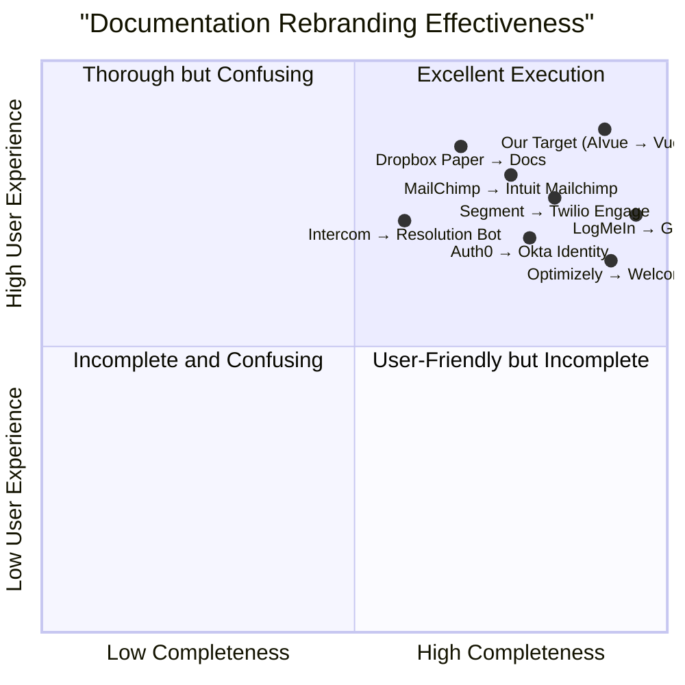

# Product Requirements Document: AIvue to Vuebie Rebranding

## Project Information
- **Project Name**: aivue_to_vuebie_rebranding
- **Date**: July 28, 2025
- **Author**: Emma, Product Manager
- **Version**: 1.0

## Original Requirements
Update all documentation files including README, user guides, API docs, and project summary files to reflect the new "Vuebie" branding. The project is located at /workspace/aivue-v2. Focus on updating any project descriptions, feature explanations, and ensuring consistent branding throughout all documentation.

## 1. Product Definition

### 1.1 Product Goals
1. **Establish Brand Consistency**: Ensure all documentation reflects the new "Vuebie" branding consistently
2. **Maintain User Experience**: Update branding without disrupting user understanding of product functionality
3. **Strengthen Market Position**: Leverage rebranding to reinforce the product's evolved market positioning

### 1.2 User Stories

1. **As a developer** using the API documentation, I want clear identification of the rebranded service so that I can correctly reference it in my code and communications.

2. **As a new user** reading the product documentation, I want consistent branding throughout all materials so that I don't get confused about the product's identity.

3. **As a returning user**, I want to understand the relationship between the old "AIvue" brand and the new "Vuebie" brand so that I can confidently continue using the product.

4. **As a support team member**, I need updated documentation with the new branding so that I can provide accurate information to customers during the transition period.

5. **As a product manager**, I want a comprehensive rebranding across all documentation so that our product positioning is clear and consistent in the market.

### 1.3 Competitive Analysis

| Competitor | Rebranding Approach | Pros | Cons |
|------------|---------------------|------|------|
| Segment → Twilio Engage | Full rebrand with gradual transition | Clear communication strategy, comprehensive documentation updates | Some customer confusion during transition period |
| Optimizely → Welcome | Complete documentation overhaul | Strong new brand identity, updated UI references | Resource-intensive process, some broken links initially |
| Intercom → Resolution Bot | Feature-specific rebranding | Targeted updates, minimal disruption | Inconsistency in broader documentation ecosystem |
| MailChimp → Intuit Mailchimp | Partial rebranding with legacy support | Maintained brand recognition, clear ownership changes | Some documentation inconsistencies persisted |
| Dropbox Paper → Dropbox Docs | UI-focused rebranding | Strong visual identity updates | Missed some API reference updates |
| LogMeIn → GoTo | Complete corporate rebrand | Comprehensive style guide, thorough documentation | Extended timeline, high resource commitment |
| Auth0 → Okta Identity | Acquisition-based rebranding | Clear product relationship explanations | Some terminology confusion in technical docs |

### 1.4 Competitive Quadrant Chart



## 2. Technical Specifications

### 2.1 Requirements Analysis

The AIvue to Vuebie rebranding requires comprehensive documentation updates across multiple file types and directories. The primary technical considerations include:

1. **Text Content Updates**: Replacing all instances of "AIvue" with "Vuebie" while maintaining proper capitalization and context
2. **Visual Asset Updates**: Ensuring all screenshots, logos, and visual references reflect the new branding
3. **URL and Path References**: Updating any URLs, file paths, or code examples that reference the old brand name
4. **API Documentation**: Updating endpoint references, parameters, and response examples
5. **Version Control**: Maintaining proper version history of documentation changes
6. **SEO Considerations**: Implementing proper redirects and metadata updates for web-based documentation
7. **Consistency Verification**: Implementing quality checks to ensure complete and consistent rebranding

### 2.2 Requirements Pool

#### P0 (Must Have)
1. Replace all direct textual references to "AIvue" with "Vuebie" in all documentation files
2. Update all headings, titles, and section names containing the brand name
3. Replace logo files and visual brand elements in documentation
4. Update code samples and API reference examples
5. Revise product descriptions and introductory sections
6. Update repository names and file paths where applicable
7. Create a transition guide explaining the rebranding to users
8. Update legal notices, copyright statements, and attributions

#### P1 (Should Have)
1. Implement comprehensive search-and-replace verification to catch edge cases (AIvue, aivue, AIVUE, etc.)
2. Update UI screenshots showing the old branding
3. Revise configuration examples containing the old brand name
4. Update links and cross-references between documentation files
5. Implement redirects for web documentation with old branding in URLs
6. Add explanatory notes about the rebranding in release notes
7. Create a glossary mapping old terminology to new terminology

#### P2 (Nice to Have)
1. Update document metadata and properties containing the old brand name
2. Implement brand consistency checking tools for future documentation updates
3. Create an automated test suite to verify brand consistency
4. Archive copies of old-branded documentation for historical reference
5. Develop a style guide for the new brand's usage in documentation
6. Create templates for new documentation with the updated branding
7. Implement analytics to track documentation usage patterns during transition

### 2.3 UI Design Draft

Below is a conceptual representation of how documentation should be updated:

#### Before (AIvue Documentation Header):
```
# AIvue Developer Documentation

Welcome to AIvue, the AI-powered video analysis platform. This documentation will guide you through using AIvue's features and APIs.

## Getting Started with AIvue
To begin using AIvue, you'll need to create an AIvue account and obtain your API credentials.
```

#### After (Vuebie Documentation Header):
```
# Vuebie Developer Documentation

Welcome to Vuebie, the AI-powered video analysis platform. This documentation will guide you through using Vuebie's features and APIs.

## Getting Started with Vuebie
To begin using Vuebie, you'll need to create a Vuebie account and obtain your API credentials.
```

For API documentation:

#### Before:
```javascript
// Initialize AIvue client
const aivue = new AIvue({
  apiKey: 'your_api_key',
  projectId: 'your_project_id'
});

// AIvue API request
const response = await aivue.analyze({
  videoUrl: 'https://example.com/video.mp4',
  options: {
    enableAIvueFaceDetection: true
  }
});
```

#### After:
```javascript
// Initialize Vuebie client
const vuebie = new Vuebie({
  apiKey: 'your_api_key',
  projectId: 'your_project_id'
});

// Vuebie API request
const response = await vuebie.analyze({
  videoUrl: 'https://example.com/video.mp4',
  options: {
    enableVuebieFaceDetection: true
  }
});
```

### 2.4 Open Questions

1. Should we implement a phased approach to documentation updates or update all documentation simultaneously?
2. Are there any specific SEO considerations for maintaining search rankings during the transition?
3. Will API endpoints change as part of this rebranding? If so, how will backward compatibility be maintained?
4. How should we communicate the rebranding to users who access the documentation frequently?
5. Are there any legal requirements or trademark considerations for updating documentation?
6. Should we maintain any references to the previous brand name for clarity during the transition period?
7. How will the rebranding affect documentation translation and localization processes?
8. What metrics should we use to measure the success of the documentation rebranding effort?

## 3. Implementation Plan

### 3.1 Documentation Inventory

First, a comprehensive inventory of all documentation files will be created to ensure nothing is missed:

1. **Project Documentation**
   - README files
   - Project summaries
   - Development plans
   - Implementation guides
   - Data models

2. **User-Facing Documentation**
   - User guides
   - Feature descriptions
   - FAQ documents
   - Release notes

3. **Technical Documentation**
   - API references
   - Integration guides
   - Code samples
   - Configuration examples
   - Architecture documents

4. **Marketing-Related Documentation**
   - Product descriptions
   - Feature comparisons
   - Case studies
   - Testimonials

### 3.2 Update Process

The documentation update process will follow these steps:

1. **Inventory and Assessment (Week 1)**
   - Complete documentation inventory
   - Analyze complexity of updates required
   - Prioritize updates based on visibility and impact

2. **Style Guide Development (Week 1)**
   - Create a rebranding style guide
   - Define handling of special cases
   - Establish quality control process

3. **Update Implementation (Weeks 2-3)**
   - Update high-priority user-facing documentation
   - Update technical documentation and API references
   - Update auxiliary documentation

4. **Quality Assurance (Week 4)**
   - Verify all references have been updated
   - Check for formatting consistency
   - Validate links and cross-references
   - Conduct user testing of updated documentation

5. **Deployment (Week 4)**
   - Release updated documentation
   - Implement redirects for web documentation
   - Announce changes to users

6. **Monitoring and Refinement (Weeks 5-6)**
   - Monitor user feedback
   - Address any reported issues
   - Make additional improvements as needed

### 3.3 Tools and Resources

The following tools and resources will be utilized:

1. **Search and Replace Tools**
   - Grep and sed for command-line searching and replacing
   - IDE search tools for batch replacements
   - Custom scripts for complex replacements

2. **Quality Assurance Tools**
   - Documentation linters
   - Link checkers
   - Brand consistency checkers

3. **Version Control**
   - Git for tracking documentation changes
   - Clear commit messages indicating rebranding updates
   - Pull request reviews to verify changes

4. **Documentation Management**
   - Centralized tracking of documentation update status
   - Progress reporting dashboards
   - Completion verification checklist

### 3.4 Success Metrics

The success of the documentation rebranding will be measured by:

1. **Completion Rate**
   - Percentage of identified documents updated
   - Coverage across different document types

2. **Quality Metrics**
   - Number of missed references identified post-deployment
   - Consistency of branding across documents

3. **User Experience**
   - User feedback on clarity of rebranded documentation
   - Support tickets related to documentation confusion

4. **Technical Accuracy**
   - Correctness of API examples and code samples
   - Functionality of updated links and references

## 4. Conclusion

The AIvue to Vuebie rebranding represents a significant evolution of the product's identity. This PRD outlines a comprehensive approach to updating all documentation to reflect the new branding while maintaining clarity, consistency, and technical accuracy. By following this plan, we will ensure a smooth transition for users and maintain the high quality of our documentation.

---

## Appendix A: Documentation Update Checklist

```markdown
# Documentation Update Checklist

## Text Content
- [ ] Product name references
- [ ] Headers and titles
- [ ] Feature descriptions
- [ ] Introduction and overview sections
- [ ] Getting started guides
- [ ] API descriptions
- [ ] Error messages and notifications
- [ ] Code comments
- [ ] Variable and parameter names
- [ ] Configuration options
- [ ] Command-line interface references

## Visual Elements
- [ ] Logo files
- [ ] UI screenshots
- [ ] Diagrams and charts
- [ ] Favicons
- [ ] Header graphics
- [ ] Watermarks and backgrounds

## Technical References
- [ ] API endpoints
- [ ] Code examples
- [ ] Sample responses
- [ ] Environment variables
- [ ] Configuration files
- [ ] CLI commands
- [ ] File paths and directories
- [ ] GitHub repository references

## Links and References
- [ ] Internal documentation links
- [ ] External website links
- [ ] Email addresses
- [ ] Social media handles
- [ ] Support references
- [ ] Download links

## Legal and Compliance
- [ ] Copyright notices
- [ ] Trademarks
- [ ] License references
- [ ] Terms of service
- [ ] Privacy policy
- [ ] Compliance documentation
```

## Appendix B: Rebranding Communication Template

```markdown
# Important Announcement: AIvue is now Vuebie

Dear [User],

We're excited to announce that AIvue is now **Vuebie**! This name change reflects our evolution and expanded vision for our product.

## What's Changing
- Our product name has changed from AIvue to Vuebie
- Our documentation has been updated to reflect the new name
- You'll see the new branding throughout our interface and materials

## What's Not Changing
- The functionality you rely on remains the same
- Your existing integrations will continue to work
- Your account credentials stay the same

## Next Steps
- Update any references in your own documentation or code
- Familiarize yourself with the new name in communications
- Reach out to our support team if you have any questions

We're excited about this new chapter and are committed to making this transition as smooth as possible for you.

Thank you for being part of our journey!

The Vuebie Team
```