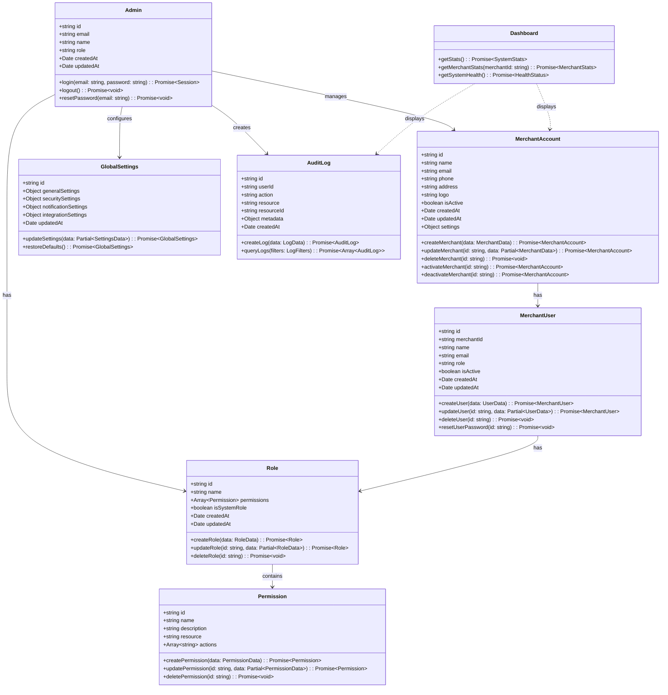
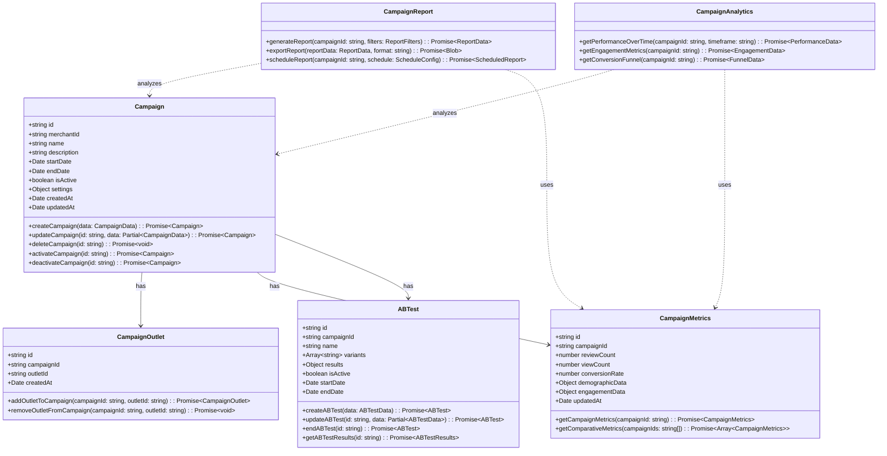
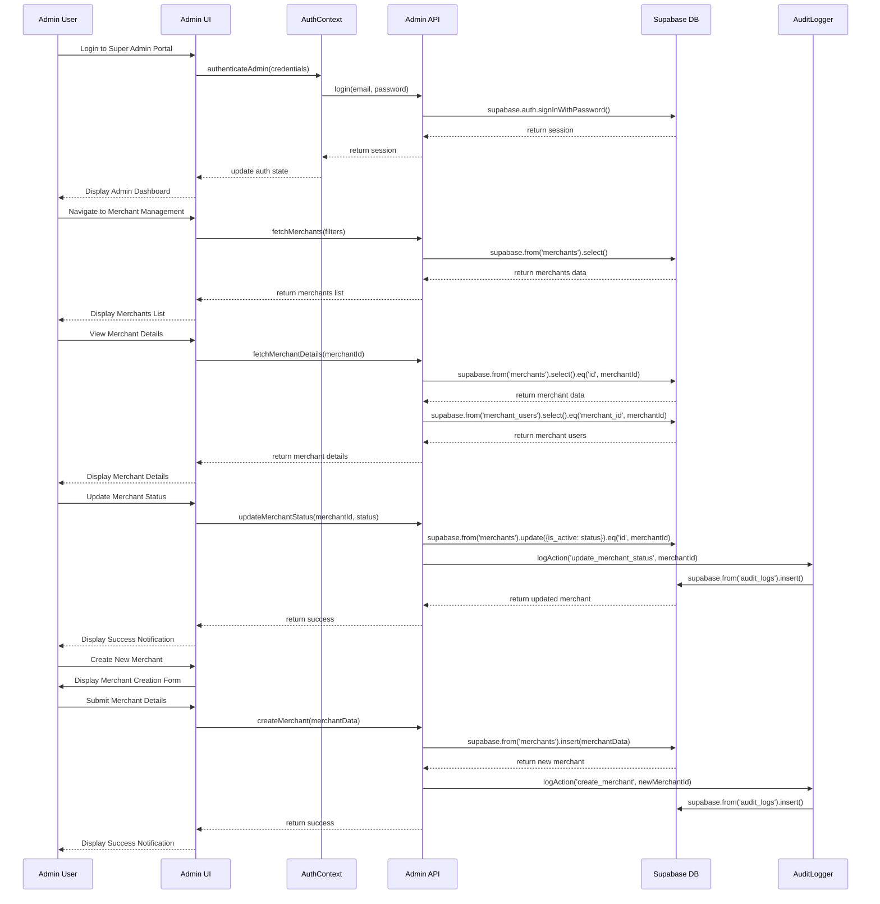
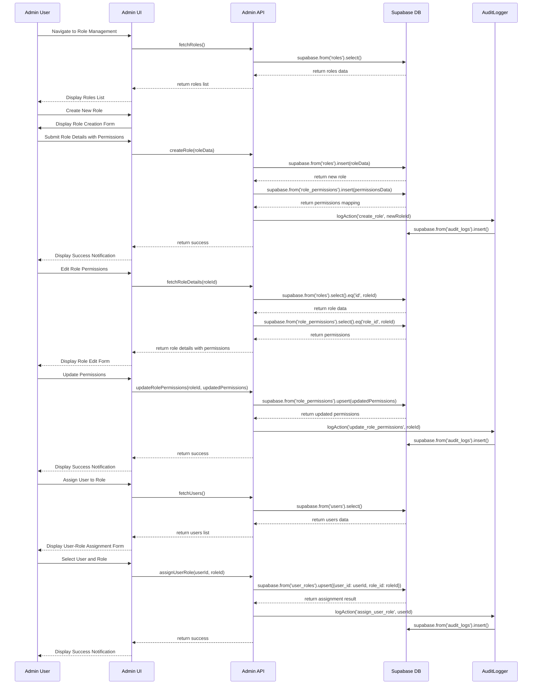
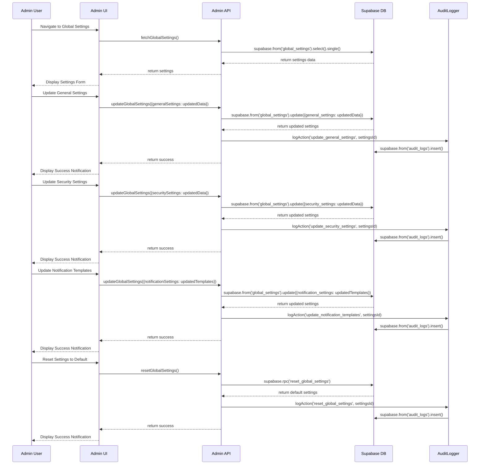
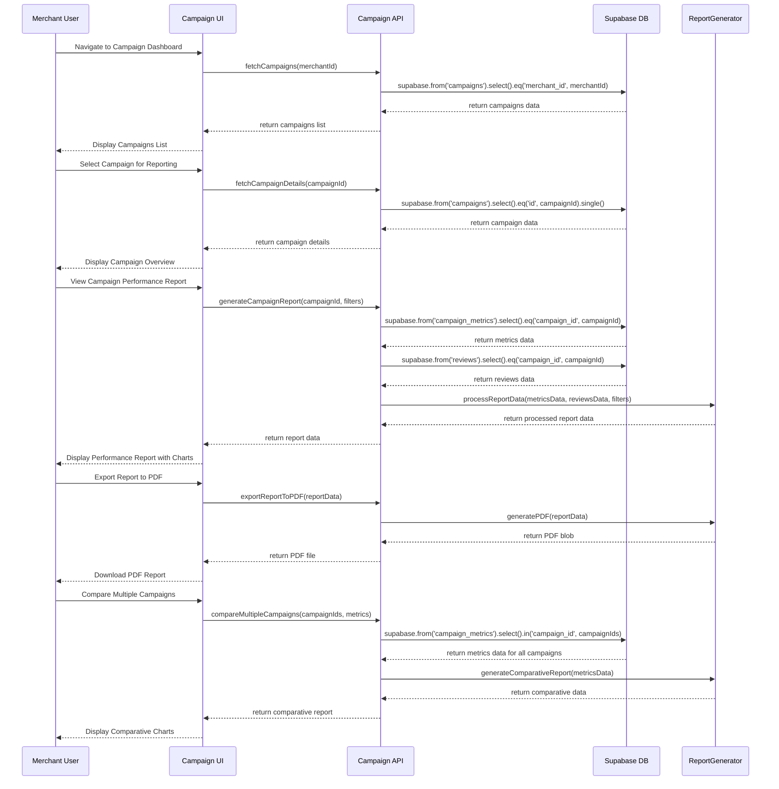
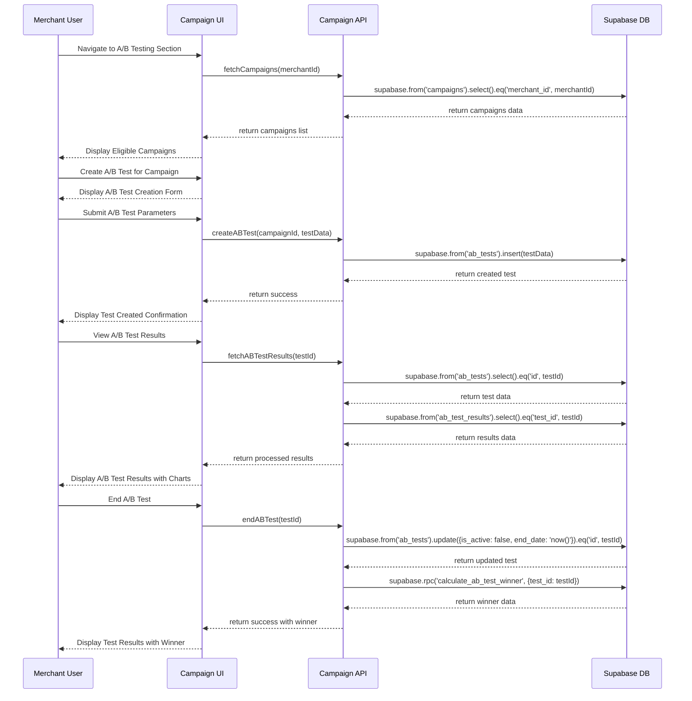

# AIvue Auto Review System V2 - Development Plan for Remaining Features

## Implementation approach

Based on the analysis of the existing AIvue Auto Review System V2 and the requirements for the remaining features, we will implement the Super Admin Portal and enhance the Campaign Management functionality in the Merchant Dashboard. We'll leverage the existing tech stack of Next.js, TypeScript, Tailwind CSS, Shadcn UI, and Supabase to ensure consistency across the application.

### Key Technologies and Libraries:

1. **Frontend**:
   - Next.js for the React framework
   - TypeScript for type safety
   - Tailwind CSS for styling
   - Shadcn UI for component library
   - React Context API for state management
   - React Query for data fetching and caching
   - React Hook Form for form handling

2. **Backend**:
   - Supabase for authentication, database, and storage
   - Supabase Edge Functions for serverless functions
   - Supabase Real-time subscriptions for live updates

3. **Utilities**:
   - Chart.js/Recharts for enhanced campaign reporting visualizations
   - React-i18next for internationalization support
   - Zod for data validation

### Super Admin Portal Implementation:

The Super Admin Portal will provide a comprehensive interface for platform administrators to oversee merchant accounts, configure global settings, and manage user roles. It will be implemented as a secure, restricted section of the application with the following components:

1. **Merchant Account Oversight**:
   - Merchant listing with filtering, sorting, and search
   - Detailed merchant profile view
   - Merchant account activation/deactivation
   - Transaction and activity logs
   - Merchant performance metrics

2. **Global Settings Configuration**:
   - Platform-wide configuration options
   - Feature toggles
   - Default values for merchant settings
   - Email notification templates
   - System maintenance controls

3. **User Role Management**:
   - Role definition and permission assignment
   - User invitation and registration workflow
   - Role-based access control (RBAC) system
   - User activity audit logs
   - Password policy and security settings

### Campaign Management Enhancements:

The existing Campaign Management functionality in the Merchant Dashboard will be enhanced with advanced reporting features:

1. **Enhanced Campaign Reporting**:
   - Detailed campaign performance metrics
   - Conversion rate analysis
   - Customer engagement analytics
   - A/B testing capabilities
   - Export functionality for reports
   - Custom date range selection
   - Comparative analysis between campaigns

## Data structures and interfaces

The following diagrams outline the key data structures, interfaces, and relationships for the new features:

### Super Admin Portal

### Enhanced Campaign Management

## Program call flow

### Super Admin Portal - Merchant Management Flow

### Super Admin Portal - User Role Management Flow

### Super Admin Portal - Global Settings Flow

### Campaign Management - Enhanced Reporting Flow

### Campaign Management - A/B Testing Flow

## Implementation timeline and resource requirements

### Super Admin Portal (4 weeks)

1. **Merchant Account Oversight (2 weeks)**
   - Week 1: Core functionality - listing, details, CRUD operations
   - Week 2: Advanced features - activity logs, metrics, filters

   **Resources**: 1 Senior Frontend Developer, 1 Backend Developer

2. **User Role Management (1 week)**
   - Days 1-3: Role definition and management
   - Days 4-7: Permission system and role assignment

   **Resources**: 1 Senior Frontend Developer, 1 Backend Developer

3. **Global Settings Configuration (1 week)**
   - Days 1-3: Settings UI and form components
   - Days 4-7: Settings persistence and application

   **Resources**: 1 Frontend Developer, 1 Backend Developer

### Campaign Management Enhancements (2 weeks)

1. **Enhanced Campaign Reporting (1 week)**
   - Days 1-3: Basic metrics and visualization
   - Days 4-7: Export functionality and comparative analysis

   **Resources**: 1 Frontend Developer, 1 Data Visualization Specialist

2. **A/B Testing Capabilities (1 week)**
   - Days 1-3: Test creation and management
   - Days 4-7: Results analysis and visualization

   **Resources**: 1 Frontend Developer, 1 Backend Developer

### Testing and Integration (1 week)

1. **Unit Testing (2 days)**
   - Super Admin Portal components
   - Enhanced Campaign Management components

   **Resources**: 1 QA Engineer

2. **Integration Testing (2 days)**
   - End-to-end workflows
   - API integration tests

   **Resources**: 1 QA Engineer, 1 Developer

3. **User Acceptance Testing (3 days)**
   - Super Admin Portal workflows
   - Campaign Management enhanced features

   **Resources**: 1 QA Engineer, 1 Product Manager

### Total Timeline: 7 weeks

## Potential challenges and dependencies

1. **Security Considerations**
   - The Super Admin Portal requires strict security measures as it handles sensitive merchant data
   - Solution: Implement strong authentication, authorization checks, and audit logging

2. **Data Migration**
   - Existing merchant data needs to be compatible with the new admin portal
   - Solution: Create data migration scripts and verify data integrity

3. **Performance at Scale**
   - The system must handle reporting on large datasets across multiple campaigns
   - Solution: Implement pagination, caching, and optimize database queries

4. **Cross-Module Dependencies**
   - The Role Management system affects both Super Admin and Merchant Dashboard
   - Solution: Design a unified permission system that works across all modules

5. **Internationalization**
   - All new features must support multiple languages
   - Solution: Ensure all new UI components use the existing i18n framework

## Conclusion

This development plan outlines the implementation of the remaining features for the AIvue Auto Review System V2, focusing on the Super Admin Portal and Campaign Management enhancements. With a total timeline of 7 weeks and the resources specified, we can complete these features while maintaining the high quality and performance standards of the existing system.

The implementation will leverage the current tech stack and architecture, ensuring consistency across the application. By addressing the potential challenges identified and carefully managing dependencies, we can deliver a robust, secure, and user-friendly system that meets all the requirements specified.